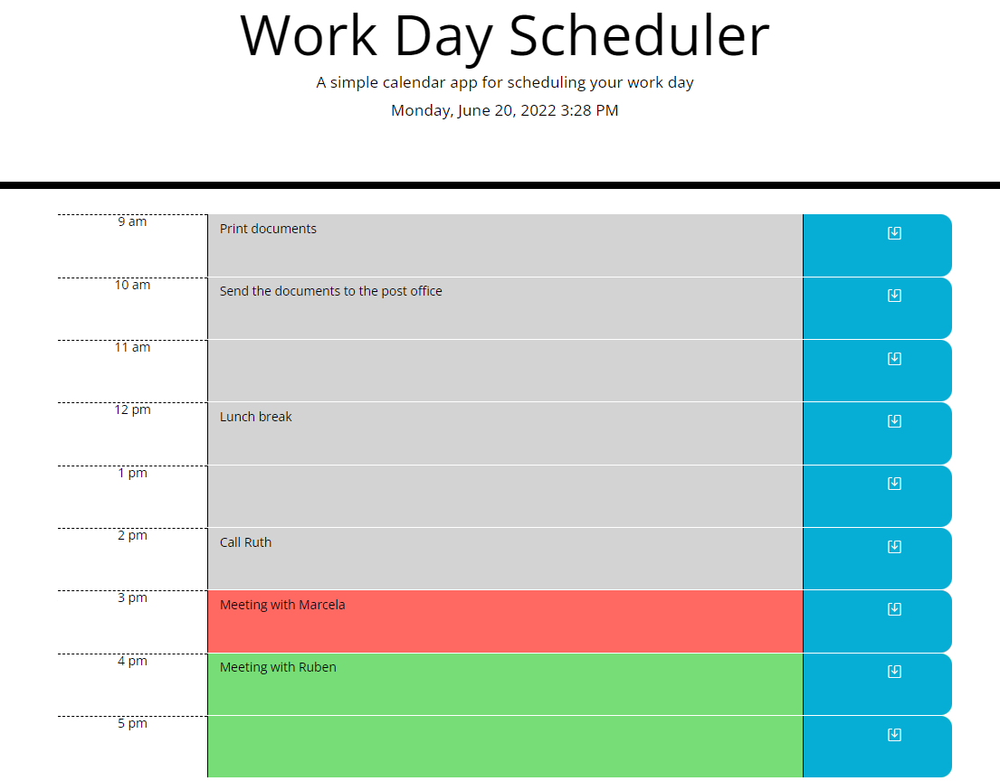

# **WORK-DAY SCHEDULER**

## **This project was created for a user to organise their day using a scheduler.**
 
* The user can see the current time and date displayed on the top of the page.
* When the user scrolls down they are presented with timeblocks for standard business hours.
* Each time block has a diferent colour indicating if the hour is in the past, present or future. 
* When the user clicks in a timeblock they can enter a task and save it by clicking the save button on the right.
* The task is saved in the local storage and displayed evrytime when the user opens or refreshes the page.

💡 See live version here: [https://marcelamejiao.github.io/Work-Day-Scheduler/](https://marcelamejiao.github.io/Work-Day-Scheduler/)

### **Preview**

